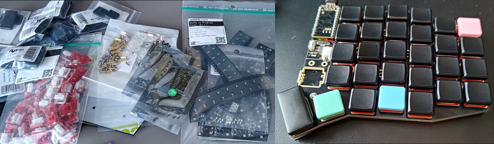

## Zmk firmware for sofle v2
### Generated with: https://keymap-drawer.streamlit.app/

## Build

### Parts list ([splitkb.com](https://splitkb.com))
- Aurora Sofle v2 PCB Kit Choc Hotswap
- nice!nano Wireless Microcontroller 2.0
- Mill Max Low Profile Sockets
- Wireless Controller Expansion Bundle
- Kailh Low Profile Choc Switches - Pro Red (linear / 35gf)
- Kailh Low Profile Choc Switches Pink (linear / 20gf mod keys)
- MoErgo POM MBK-Profile Keycaps
- MBK PBT Coloured Blank Keycaps (mod keys)
